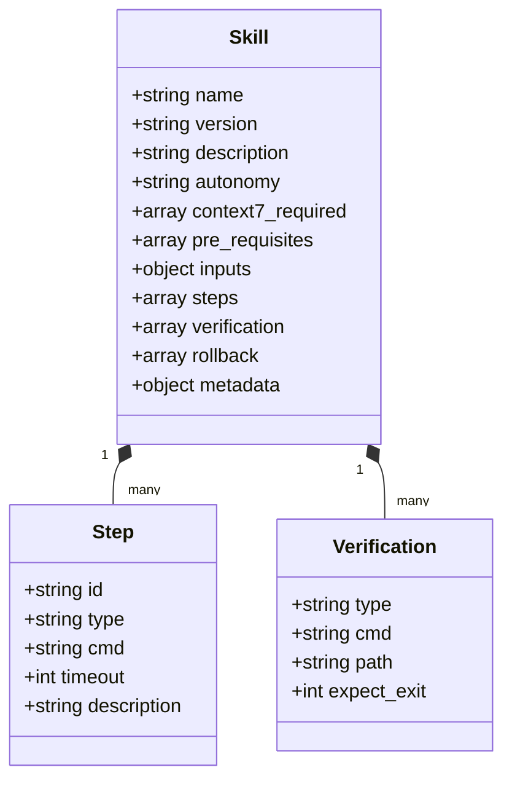
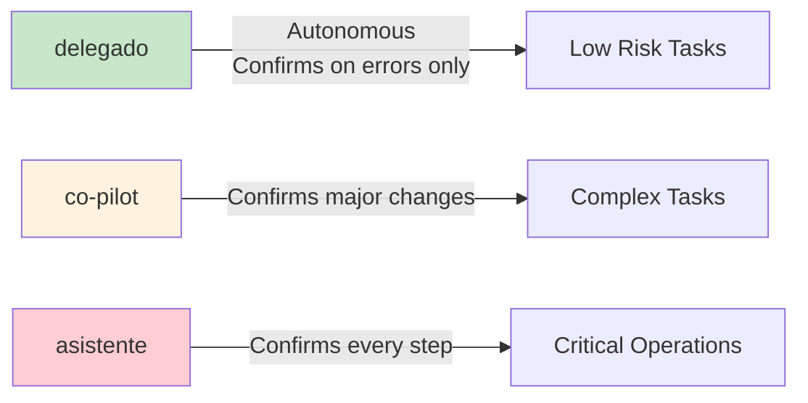
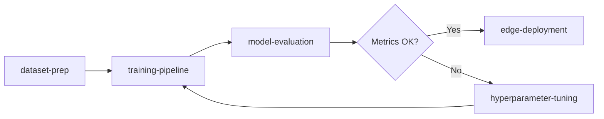

# Agent Orchestration Architecture

<p align="center">
  <strong>A structured skill-based system for AI agent orchestration</strong><br>
  JSON Schema validation • Execution enforcement • Comprehensive logging
</p>

<p align="center">
  <a href="#quick-start">Quick Start</a> •
  <a href="#available-skills">Skills</a> •
  <a href="#architecture">Architecture</a> •
  <a href="#creating-skills">Create Skills</a> •
  <a href="#references">References</a>
</p>

<p align="center">
  
  
  
</p>

---

## Why This Exists

AI coding agents are powerful but can hallucinate, skip steps, or lose context. This system provides:

- **Structured execution** — Skills define exact steps, preventing agents from improvising
- **Schema validation** — JSON Schema ensures skills are well-formed before execution  
- **Autonomy levels** — Control how much confirmation the agent needs
- **Rollback support** — Failed steps can be automatically reverted
- **Execution logs** — Full history with timing and error tracking

Built following [Anthropic's "Building Effective Agents"](https://www.anthropic.com/research/building-effective-agents) principles.

---

## Architecture

```mermaid
%%{init: {'theme':'dark', 'themeVariables': { 'primaryColor':'#3b82f6', 'primaryTextColor':'#ffffff', 'edgeLabelBackground':'#1e1e1e' }}%%
flowchart TB
    subgraph Input
        A[skill.json] --> B[Skill Controller]
        C[User Inputs] --> B
    end
    
    subgraph Validation
        B --> D{JSON Schema<br/>Valid?}
        D -->|No| E[❌ Error]
        D -->|Yes| F[Check Prerequisites]
        F --> G{Commands<br/>exist?}
        G -->|No| E
    end
    
    subgraph Execution
        G -->|Yes| H[Load Context7 Docs]
        H --> I[Execute Steps]
        I --> J{Step<br/>Success?}
        J -->|No| K[🔄 Rollback]
        K --> E
        J -->|Yes| L{More<br/>Steps?}
        L -->|Yes| I
    end
    
    subgraph Output
        L -->|No| M[Run Verification]
        M --> N{Verified?}
        N -->|No| K
        N -->|Yes| O[✅ Success]
        O --> P[📝 Log Results]
    end
    
    style A fill:#e1f5fe
    style O fill:#c8e6c9
    style E fill:#ffcdd2
    style K fill:#fff3e0
```



### Skill Structure



### Project Structure

```
agent-orchestration-architecture/
├── skill_controller.py      # Skill execution engine
├── workflow_controller.py   # Multi-skill orchestrator
├── schemas/
│   ├── skill-schema.json    # Skill validation schema
│   └── workflow-schema.json # Workflow validation schema
├── SKILLS/                  # 19 skill definitions
│   ├── yolo26-detection/
│   │   └── skill.json
│   ├── sam3-segmentation/
│   ├── mvp-nextjs/
│   └── ...
├── WORKFLOWS/               # Multi-skill pipelines
└── TEMPLATES/               # Project templates
```

---

## Quick Start

```bash
# Clone
git clone https://github.com/ign24/agent-orchestration-architecture.git
cd agent-orchestration-architecture

# Install minimal dependencies
pip install jsonschema

# List available skills
python skill_controller.py --list

# Get skill details
python skill_controller.py --info yolo26-detection

# Dry run (no execution)
python skill_controller.py --execute sam3-segmentation \
  --inputs '{"source": "video.mp4", "prompts": ["person"]}' \
  --dry-run

# Real execution
python skill_controller.py --execute mvp-nextjs \
  --inputs '{"project_name": "my-app"}'
```

---

## Available Skills

### Computer Vision / ML (13 skills)

| Skill | Description |
|-------|-------------|
| `yolo26-detection` | YOLO26 object detection (NMS-Free, +43% CPU speed) |
| `yolo26-segmentation` | Instance segmentation with semantic seg loss |
| `yoloe-open-vocabulary` | Open-vocabulary detection (4,585 classes) |
| `sam3-segmentation` | SAM3 via Ultralytics with text prompts |
| `fvm-fine-tuning` | PEFT fine-tuning (LoRA, DoRA, GaLore) |
| `training-pipeline` | Complete YOLO training pipeline |
| `dataset-prep` | Dataset preparation for YOLO format |
| `model-evaluation` | Evaluation with mAP, confusion matrix |
| `video-tracking` | Multi-object tracking (BYTETrack, StrongSORT) |
| `data-augmentation-advanced` | Advanced augmentation (Albumentations, etc) |
| `hyperparameter-tuning` | Auto-tuning with genetic algorithms |
| `edge-deployment-optimized` | Edge deployment (TensorRT, INT8/FP16) |
| `cv-mlops-setup` | MLOps pipeline (MLflow, DVC, Evidently) |

### Development (3 skills)

| Skill | Description |
|-------|-------------|
| `mvp-nextjs` | Next.js 15 + React 19 + shadcn/ui scaffold |
| `mvp-fastapi` | FastAPI + Pydantic v2 backend |
| `feature-auth` | Supabase authentication integration |

### Operations (3 skills)

| Skill | Description |
|-------|-------------|
| `deploy-vercel` | Vercel deployment with environment setup |
| `debug-systematic` | Systematic debugging methodology |
| `yolo-detection` | Legacy YOLO detection setup |

---

## Skill Anatomy

Each skill is a JSON file with this structure:

```json
{
  "name": "sam3-segmentation",
  "version": "2.0.0",
  "description": "SAM3 text-prompted segmentation via Ultralytics",
  "autonomy": "co-pilot",
  
  "context7_required": ["/ultralytics/ultralytics"],
  
  "pre_requisites": [
    {"check": "command_exists", "args": ["python"]}
  ],
  
  "inputs": {
    "source": {"type": "string", "required": true},
    "prompts": {"type": "array", "required": true},
    "confidence": {"type": "number", "default": 0.35}
  },
  
  "steps": [
    {
      "id": "verify_install",
      "type": "bash",
      "cmd": "python -c 'import ultralytics'",
      "timeout": 30
    },
    {
      "id": "run_inference",
      "type": "bash", 
      "cmd": "python run_sam3.py --source {source}",
      "timeout": 600
    }
  ],
  
  "verification": [
    {"type": "dir_exists", "path": "{output_path}"}
  ],
  
  "rollback": [
    {"id": "cleanup", "cmd": "rm -rf outputs/"}
  ]
}
```

### Autonomy Levels



| Level | Behavior | Use Case |
|-------|----------|----------|
| `delegado` | Runs autonomously, confirms only on errors | Well-defined, low-risk tasks |
| `co-pilot` | Confirms before major changes | Complex tasks |
| `asistente` | Confirms every step | Critical operations (deploy, delete) |

---

## Creating Skills

1. **Create directory**
   ```bash
   mkdir SKILLS/my-skill
   ```

2. **Create skill.json** following the schema
   ```bash
   cat schemas/skill-schema.json
   ```

3. **Validate**
   ```bash
   python skill_controller.py --info my-skill
   ```

4. **Test**
   ```bash
   python skill_controller.py --execute my-skill --dry-run
   ```

---

## Workflows

Chain multiple skills together:



```bash
python workflow_controller.py --execute ml-experiment \
  --inputs '{"dataset": "coco", "model": "yolo26n"}'
```

---

## Logging

All executions are logged to `outputs/skill_logs/`:

```json
{
  "timestamp": "2026-01-19T10:19:48",
  "skill": "sam3-segmentation",
  "version": "2.0.0",
  "succe
