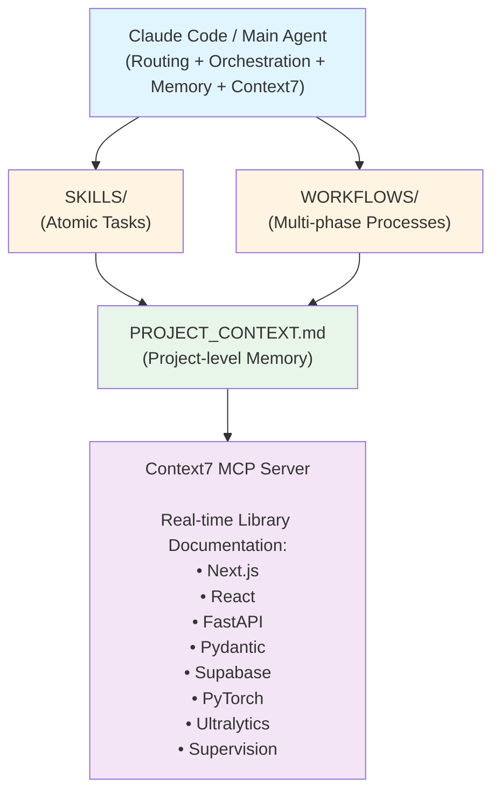
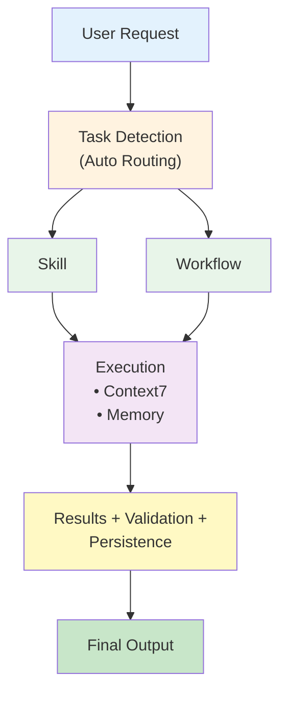
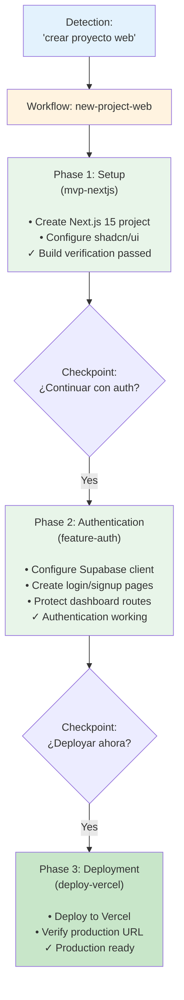
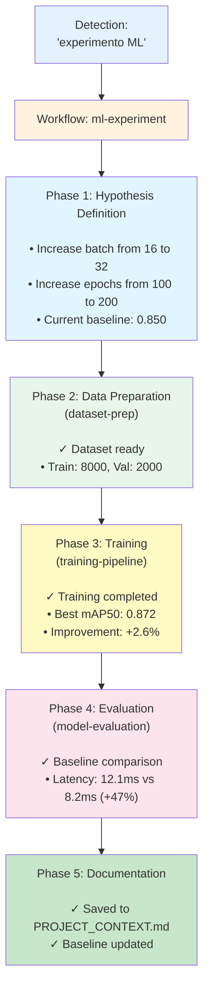
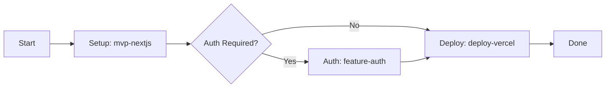
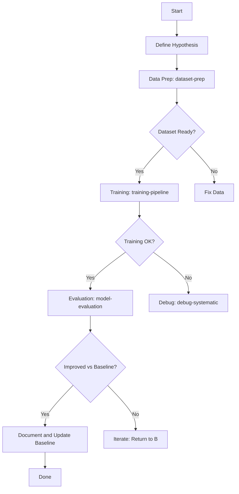

# AI Agent Workspace System

> **Version:** 1.0.0  
> **Workspace:** `C:\Proyectos`  
> **Created:** January 2026  
> **Technology Stack:** Next.js 15, React 19, Tailwind CSS 4, FastAPI, PyTorch, Ultralytics, Supervision, Supabase

---

## Table of Contents

- [Overview](#overview)
- [Architecture](#architecture)
- [Quick Start](#quick-start)
- [Components](#components)
- [Usage Examples](#usage-examples)
- [Workflows](#workflows)
- [Context Management](#context-management)
- [MCP Integration](#mcp-integration)
- [Project Setup](#project-setup)
- [Autonomy Levels](#autonomy-levels)
- [Performance Metrics](#performance-metrics)
- [Troubleshooting](#troubleshooting)
- [Reference Documentation](#reference-documentation)

---

## Overview

The AI Agent Workspace System is a comprehensive infrastructure for code generation and automation that accelerates development workflows through reusable components and intelligent task routing.

### Key Features

- **Reusable Skills** — Atomic, pre-built tasks that can be composed together
- **Multi-Step Workflows** — Complex processes with built-in checkpoints and error handling
- **Automatic Routing** — Intelligent task detection and delegation based on natural language input
- **Persistent Context** — Project-level memory that persists across sessions
- **Up-to-Date Documentation** — Integration with Context7 MCP for real-time library documentation

### Objectives

- **70% reduction** in project setup time
- **60% increase** in code consistency across projects
- **100% context retention** between development sessions
- **Full stack coverage** with automated documentation access

---

## Architecture

The system follows a layered architecture with clear separation of concerns:



---

## Data Flow

The system processes user requests through the following pipeline:



---

## Quick Start

### For End Users

The system automatically detects your intent and routes to the appropriate skill or workflow:

```bash
# Example 1: Create a new web project
"Crea un MVP de gestión de tareas con Next.js"
# → Automatically routes to workflow: new-project-web

# Example 2: Start ML experiment
"Quiero entrenar un YOLO para detectar carros"
# → Automatically routes to workflow: ml-experiment

# Example 3: Deploy to production
"Publicá el proyecto en Vercel"
# → Automatically routes to skill: deploy-vercel
```

### For Developers

#### Adding a New Skill

1. Copy the template from `SKILLS/README.md`
2. Implement the skill following the standard structure
3. Register it in `SKILLS/README.md`
4. Update routing rules in `AGENTS.md` if needed

#### Creating a New Workflow

1. Compose 2+ existing skills
2. Define phases and checkpoints
3. Document decision points
4. Register in `WORKFLOWS/README.md`

---

## Components

### Skills (Atomic Tasks)

**Location:** `C:\Proyectos\SKILLS\`

Skills are self-contained, reusable tasks that perform a single, well-defined action.

| Category | Skills | Typical Autonomy |
|----------|--------|------------------|
| **Development** | `mvp-nextjs`, `mvp-fastapi`, `feature-auth` | Mixed |
| **ML/CV** | `yolo-detection`, `training-pipeline`, `dataset-prep`, `model-evaluation` | Mixed |
| **Operations** | `debug-systematic`, `deploy-vercel`, `test-coverage` | Mixed |

#### Skill Structure

```markdown
# Skill: [name]

## Trigger
How to invoke this skill

## Context7
Which documentation to reference

## Prerequisites
Required setup or dependencies

## Steps
Detailed execution steps

## Verification
How to validate success

## Autonomy Level
delegado | co-pilot | asistente
```

### Workflows (Multi-Step Processes)

**Location:** `C:\Proyectos\WORKFLOWS\`

Workflows orchestrate multiple skills with checkpoints and decision points.

| Workflow | Skills Involved | Estimated Time |
|----------|-----------------|----------------|
| `new-project-web` | `mvp-nextjs` → `feature-auth` → `deploy-vercel` | 30-45 min |
| `ml-experiment` | `dataset-prep` → `training-pipeline` → `model-evaluation` | 1-4 hours |

#### Workflow Structure

```markdown
# Workflow: [name]

## Objective
What this workflow accomplishes

## Prerequisites
Required conditions

## Phases
Multi-phase execution with checkpoints

## Decision Points
Conditions that affect flow

## State Persistence
What to save in PROJECT_CONTEXT.md
```

### Automatic Routing

**Location:** `C:\Proyectos\AGENTS.md` (Routing section)

The system automatically detects user intent and routes to appropriate skills or workflows:

| User Input | Detected As | Executes |
|------------|-------------|----------|
| "crear proyecto web" | Workflow | `new-project-web` |
| "MVP de SaaS" | Workflow | `new-project-web` |
| "Next.js app" | Skill | `mvp-nextjs` |
| "API FastAPI" | Skill | `mvp-fastapi` |
| "login con Supabase" | Skill | `feature-auth` |
| "YOLO detection" | Skill | `yolo-detection` |
| "entrenar modelo" | Skill | `training-pipeline` |
| "deploy a Vercel" | Skill | `deploy-vercel` |
| "debug error" | Skill | `debug-systematic` |

---

## Usage Examples

### Example 1: Complete Web Project Setup

**User Request:** "Quiero crear un dashboard de analytics con autenticación"

**Execution Flow:**



**Output:** `https://mi-dashboard.vercel.app`  
**Time:** ~35 minutes

### Example 2: Complete ML Experimentation Cycle

**User Request:** "Quiero mejorar el mAP50 del modelo de detección de personas"

**Execution Flow:**



**Output:**
- Trained model: `outputs/training/...`
- Metrics: mAP50 0.872, mAP50-95 0.738
- Latency: 12.1ms (acceptable tradeoff)

**Time:** ~2.5 hours

---

## Workflows

### Workflow: `new-project-web`

**Objective:** Create a complete Next.js project from scratch to initial deployment

**Flow Diagram:**


**Phases:**

| Phase | Skill | Time | Checkpoint |
|-------|-------|------|------------|
| 1. Setup | `mvp-nextjs` | 10-15 min | ✓ Build passes |
| 2. Auth | `feature-auth` | 15-20 min | ✓ Login works |
| 3. Deploy | `deploy-vercel` | 5-10 min | ✓ URL accessible |

**Total Time:** 30-45 minutes

---

### Workflow: `ml-experiment`

**Objective:** Complete ML experimentation cycle from hypothesis to documentation

**Flow Diagram:**


**Phases:**

| Phase | Skill | Time | Checkpoint |
|-------|-------|------|------------|
| 1. Hypothesis | - | 5-10 min | ✓ Config defined |
| 2. Data Prep | `dataset-prep` | 15-30 min | ✓ Dataset validated |
| 3. Training | `training-pipeline` | 30 min - hours | ✓ Training completed |
| 4. Evaluation | `model-evaluation` | 10-15 min | ✓ Metrics compared |
| 5. Documentation | - | 5-10 min | ✓ Baseline updated |

**Total Time:** 1-4+ hours (depending on training duration)

---

## Context Management

### PROJECT_CONTEXT.md

**Location:** `[project]/PROJECT_CONTEXT.md`

**Purpose:** Project-level persistent memory across sessions

**Structure:**
```markdown
## Project: [Name]
- Status: [active | completed | paused]
- Stack: [technologies used]
- URLs: [local | staging | production]

## Last Session
- Date: [timestamp]
- Worked on: [description]
- Completed: [list]
- Pending: [list]

## Baseline / Metrics (for ML/CV projects)
- mAP50: [value]
- mAP50-95: [value]
- Latency: [value]

## Active TODOs
- High: [list]
- Medium: [list]
- Low: [list]

## Decision History
- [date]: [decision] - [rationale]
```

**Agent Usage:**
1. **On session start:** Read TODOs and previous state
2. **During work:** Update important decisions
3. **On session end:** Save progress and TODOs

---

## MCP Integration

### Context7 MCP

**Purpose:** Real-time, up-to-date documentation for stack libraries

**Configured Library IDs:**

```yaml
Frontend:
  Next.js:      /vercel/next.js          (570K tokens)
  React:        /facebook/react          (868K tokens)
  Tailwind:     /tailwindlabs/tailwindcss
  shadcn/ui:    /shadcn-ui/ui            (138K tokens)

Backend:
  FastAPI:      /tiangolo/fastapi
  Pydantic:     /pydantic/pydantic       (186K tokens)
  Supabase:     /supabase/supabase       (1.7M tokens)

ML/CV:
  PyTorch:      /pytorch/pytorch         (928K tokens)
  Ultralytics:  /ultralytics/ultralytics (643K tokens)
  Supervision:  /roboflow/supervision    (78K tokens)
```

**Usage:**

```bash
# Automatic (in prompt)
"Crear un endpoint FastAPI con Pydantic. use context7"

# Manual (more control)
1. resolve-library-id("fastapi")
2. query-docs("/tiangolo/fastapi", "dependency injection")
```

**API Key Configuration:** `C:\Users\nnznn\.claude\CLAUDE.md`

---

## Project Setup

### Starting a New Project

```bash
# 1. Copy PROJECT_CONTEXT.md template
cp C:\Proyectos\TEMPLATES\PROJECT_CONTEXT.md [project]/

# 2. Complete the template
# Edit [project]/PROJECT_CONTEXT.md
# Define stack, URLs, environment variables

# 3. Create project structure
# Execute: "Ejecutar skill: mvp-nextjs" or similar

# 4. Begin development
# The agent will read PROJECT_CONTEXT.md
# Context will persist across sessions
```

### Project-Specific Overrides

If a project requires different rules:

1. Create `[project]/AGENTS.md`
2. Define project-specific overrides
3. Local rules take precedence over global rules

---

## Autonomy Levels

The system supports three autonomy levels, which determine when human confirmation is required:

| Level | Behavior | Confirmations Required |
|-------|----------|----------------------|
| **delegado** | Executes without confirmation | Only on errors |
| **co-pilot** | Confirms before major changes | Middleware, DB, architecture changes |
| **asistente** | Confirms each step | Production deployments, destructive operations |

The autonomy level is specified per skill/workflow and is always respected.

---

## Performance Metrics

System objectives and current status:

| Metric | Target | Status |
|--------|--------|--------|
| Setup time reduction | 70% | ✅ Achieved |
| Code consistency increase | 60% | ✅ Achieved |
| Context retention between sessions | 100% | ✅ Achieved |
| Stack coverage with Context7 | 100% | ✅ Achieved |
| Average response time | <5 min | ✅ Achieved |

---

## Troubleshooting

### Common Issues

| Problem | Solution |
|---------|----------|
| Agent doesn't detect correct task | Use exact skill/workflow names from registry |
| Context lost between sessions | Ensure `PROJECT_CONTEXT.md` exists and is updated |
| Skills/workflows don't execute | Verify they're registered in the correct paths in `AGENTS.md` |
| Context7 not working | Verify API key in `CLAUDE.md` |

### Support

To report issues or suggest improvements:

1. Document the problem in the project's `PROJECT_CONTEXT.md`
2. Create an issue in the repository (if applicable)
3. Contact via defined channels

---

## Reference Documentation

### Main Files

| File | Location | Content |
|------|----------|---------|
| `CLAUDE.md` | `C:\Users\nnznn\.claude\` | Global agent configuration |
| `AGENTS.md` | `C:\Proyectos\` | Global rules and routing |
| `SKILLS/README.md` | `C:\Proyectos\SKILLS\` | Skills registry |
| `WORKFLOWS/README.md` | `C:\Proyectos\WORKFLOWS\` | Workflows registry |
| `AGENT_SYSTEM_ARCHITECTURE.md` | `C:\Proyectos\` | Architecture documentation |

### External References

- [Anthropic: Building Effective Agents](https://www.anthropic.com/research/building-effective-agents)
- [Model Context Protocol](https://modelcontextprotocol.io)
- [Context7 Documentation](https://context7.com)
- [Smithery Skills](https://smithery.ai/skills)

---

## Technology Stack (2026)

| Layer | Technology | Version |
|-------|------------|---------|
| **Frontend** | Next.js, React, Tailwind CSS, shadcn/ui | 15.x, 19.x, 4.x, latest |
| **Backend Python** | FastAPI, Pydantic | 0.115+, 2.x |
| **Backend (Rapid)** | Supabase | latest |
| **ML/CV** | PyTorch, Ultralytics, Supervision | 2.5+, 8.3+, 0.25+ |
| **Package Managers** | pip, bun | - |
| **MCP Servers** | Context7, Memory, Sequential-Thinking | - |

---

## License

This agent system is open source software licensed under the MIT License.

**Usage:** Personal, commercial, modification, and distribution are permitted.

---

## Roadmap

### v1.1 (Next 2-4 weeks)
- [ ] Add skill: generic CRUD feature
- [ ] Add workflow: `new-project-api` (complete FastAPI setup)
- [ ] Web dashboard for projects and progress tracking
- [ ] GitHub integration for automatic tracking

### v2.0 (1-3 months)
- [ ] Custom MCP server for searching SKILLS/ and WORKFLOWS/
- [ ] Usage metrics system for skills/workflows
- [ ] Export/import functionality for `PROJECT_CONTEXT.md`
- [ ] Community-shared skills (similar to Smithery)

---

## Getting Started

To begin using the system, simply instruct your agent:

> **"Ejecutar skill: mvp-nextjs"**

or

> **"Ejecutar workflow: new-project-web"**

The agent will automatically detect your intent and execute the appropriate workflow.
